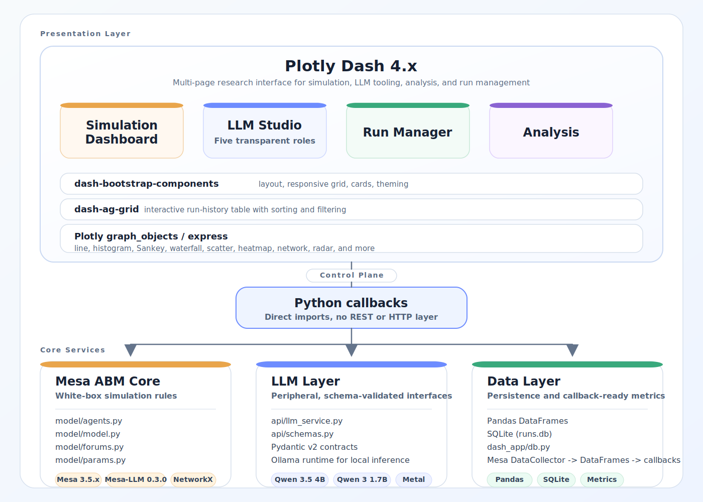

# The Convenience Paradox

### Agent-Based Modeling of Service Delegation and Social Involution

> *"Does optimising for individual convenience produce collective well-being — or collective exhaustion?"*

This model explores abstract social dynamics and is not intended to characterise or evaluate any specific society, culture, or nation.

---

## Contents

- [Overview](#overview)
- [User interface demonstration](#user-interface-demonstration)
- [Architecture](#architecture)
- [Research question and hypotheses](#research-question)
- [Simulation model](#simulation-model)
- [Features](#features)
- [Setup and running](#setup-and-running)
- [Testing](#testing)
- [Repository layout](#repository-layout)
- [Empirical grounding](#empirical-grounding)
- [Reflections on ABM and LLM](#reflections-on-abm-and-llm-for-social-systems)
- [Citation and license](#citation)

---

## Overview

**The Convenience Paradox** is a computational social science project that uses **Agent-Based Modeling (ABM)** to investigate whether widespread service delegation (outsourcing daily tasks to third-party providers) produces a systemic paradox: greater convenience for individuals, but greater total labour and growing inequality at the system level — an **involution spiral**.

The project is built as a full-stack interactive research tool:

| Layer            | Technology                                          |
| ---------------- | --------------------------------------------------- |
| ABM Engine       | Mesa 3.5.x + Mesa-LLM 0.3.0                         |
| Local LLM        | Ollama + Qwen 3.5 4B                                |
| Web dashboard    | Plotly Dash 4.x + dash-bootstrap-components + dash-ag-grid |
| Visualisation    | Plotly (interactive) + Matplotlib (publication)     |
| Run history      | SQLite (`runs.db`, via `dash_app/db.py`)            |
| Environment      | Python 3.12, Miniconda3                             |

**Neutrality notice**: The model is parameterized in abstract terms only. It does not characterise, evaluate, or make claims about any specific country, culture, or people. “Type A” and “Type B” are purely abstract configuration presets.

The latest validated analysis is based on a `research_v2` offline campaign of **14,656 simulation runs** across four research packages. A full write-up of those results is available in [formal_research_report.md](formal_research_report.md).

---

## User interface demonstration

The dashboard is a four-page interactive research tool. Each page is described below, with a placeholder for a demo animation.

### Simulation Dashboard

The primary page for running and monitoring ABM simulations in real time.

<!-- 📽️ GIF placeholder — record: select a preset, click Initialize, step through 30+ steps, show KPI cards updating and charts animating -->


**What you can do:**

- **Preset selector** — switch between *Type A (Autonomy-Oriented)* and *Type B (Convenience-Oriented)* configurations, or dial in a custom scenario with 11 parameter sliders (delegation mean, service cost, conformity pressure, task load, population size, and more).
- **Live KPI bar** — four summary cards (Avg Stress, Total Labor Hours, Social Efficiency, Income Gini) update after every simulation step.
- **10 interactive Plotly charts** covering all four research hypotheses:
  - *Total Labor Hours* time series — the primary involution signal (H1).
  - *Stress & Delegation* dual-axis trend — tracks the convenience-spiral dynamic (H2/H3).
  - *Stress Distribution* histogram + *Delegation Preferences* distribution — reveals polarisation drift (H4).
  - *Social Efficiency* trend + *Market Health* bar/line (unmatched tasks) — exposes the delegation threshold (H2).
  - *Provider vs Consumer* scatter with stress colour encoding — shows role stratification emerging live.
- **Advanced flow and topology views** — Task Flow Sankey (service pipeline per step), Fee Flow Waterfall (economic transfers), and a force-directed Network Topology where node size encodes hours spent providing services and node colour encodes stress.

---

### LLM Studio

A unified interface for all five LLM roles. Each role has an independent model selector (populated from the live Ollama instance) and its own input/output panel. Every interaction is logged to the session audit trail

**Role 1 | Scenario Parser**

Paste a natural-language society description → LLM extracts five `SimulationParams` (delegation mean, service cost, conformity, tasks per step, population) → one-click apply to the Simulation Dashboard.


**Role 2 | Profile Generator**

Describe an agent persona in plain text → LLM generates a `delegation_preference` value and four skill scores (domestic, administrative, errand, maintenance) → inspectable JSON before injection.


**Role 3 | Result Interpreter**

Ask any research question → LLM receives six live simulation metrics and six parameter values as context → returns a narrative explanation referenced to the active hypothesis.


**Role 4 | Viz Annotator**

Supplies the current chart's data context → LLM generates a chart caption and three key quantitative insights.


**Role 5 | Agent Forums *(Experimental)***

Select a participant cohort → up to three LLM dialogue turns on delegation norms → bounded preference update of ±0.06 max per agent → visible in the next simulation step. Clearly labelled as experimental in the UI.


---

### Run Manager

An experiment database with query, comparison, and deletion capabilities, powered by Dash AG Grid.

<!-- 📽️ GIF placeholder — record: show the AG Grid table, apply a preset filter, select two runs, choose a metric, click Compare, show the overlay trend chart -->


**What you can do:**

- **Interactive AG Grid table** — sortable and filterable columns: run name, preset, agent count, steps, delegation rate, avg stress, income Gini, and timestamp.
- **Filter bar** — free-text search by run name, preset dropdown (Type A / Type B / Custom), and a date-range picker.
- **Save & delete** — name and save the current simulation run; delete selected rows with cascade to the step-level metrics table.
- **Side-by-side comparison** — select up to 6 runs, choose one metric, and click *Compare* to render a summary KPI card per run alongside an aligned trend chart overlay for time-series comparison across runs.

---

### Analysis

Research results presentation with a hypothesis scoreboard, automated A/B comparison, and an exploratory sensitivity heatmap in the dashboard, complemented by larger offline campaign evidence in the formal reporting pipeline.

<!-- 📽️ GIF placeholder — record: show the 4 hypothesis cards with expandable panels, click “Run Both Presets”, show the comparison table and bar chart populating, then trigger the sensitivity heatmap -->


**What you can do:**

- **Hypothesis scoreboard** — four cards (H1–H4) with status badges and expandable evidence panels that summarise the current research framing; the formal report extends these cards with larger offline campaign evidence.
- **Type A vs Type B comparison** — one click runs both presets back-to-back server-side, then populates a six-metric comparison table (with percentage differences) and a grouped bar chart.
- **Sensitivity heatmap** — an on-demand 5×5 dashboard sweep across delegation mean (0.2–0.8) × service cost factor (0.1–0.8), rendered as an interactive Plotly heatmap for exploratory use; the validated formal findings come from the much larger offline `research_v2` campaign.

---

## Architecture

The project is structured in three clearly separated layers — ABM core, LLM periphery, and data — unified by a Plotly Dash multi-page web application. Dash callbacks call simulation and service code directly via Python imports; no REST layer is involved.



### Component summary

| Layer | Library / Tool | Role |
| ----- | -------------- | ---- |
| Web framework | Plotly Dash 4.x + Dash Pages | Multi-page SPA routing, callback system |
| UI components | dash-bootstrap-components | Responsive grid, cards, modals, badges |
| Data table | dash-ag-grid | Sortable, filterable run-history grid |
| Charts | Plotly `graph_objects` / `express` | All interactive figures (line, histogram, Sankey, waterfall, scatter, heatmap, network, radar) |
| ABM engine | Mesa 3.5.x + Mesa-LLM 0.3.0 | Rule-based agent simulation; `AgentSet`, `DataCollector`, `NetworkGrid` |
| Social network | NetworkX | Watts–Strogatz small-world graph (k=4, p=0.1) |
| LLM runtime | Ollama + Qwen 3.5 4B | Local inference; Metal-accelerated on Apple Silicon |
| Schema validation | Pydantic v2 | Structured LLM output contracts (`api/schemas.py`) |
| Persistence | SQLite via `dash_app/db.py` | Run history, step-level metrics |
| Analysis | Pandas 3.x + Matplotlib 3.x | Batch processing, publication figures |

---

## Research question

> *How do different levels of service delegation in a society affect individual well-being (leisure time, stress) and collective efficiency? Under what conditions does a "convenience spiral" (involution) emerge?*

### Hypotheses

|        | Hypothesis                                                              | Status                                                                       |
| ------ | ----------------------------------------------------------------------- | ---------------------------------------------------------------------------- |
| **H1** | Higher delegation leads to higher total systemic labour hours           | Strong support — Type B maintains a ~30.0% labour premium at long horizon    |
| **H2** | A critical delegation threshold triggers irreversible involution spiral | Strong support — overload onset concentrates in a narrow 3.0–3.25 task band |
| **H3** | Higher autonomy achieves lower stress and higher aggregate well-being   | Partial support — Type A preserves substantially more available time         |
| **H4** | Mixed-delegation societies are unstable, drifting toward one extreme    | Partial (important negative) — mixed-state dispersion stays weak            |

### Latest validated findings (formal campaign)

The latest validated summary comes from the `research_v2` offline campaign documented in [formal_research_report.md](formal_research_report.md). This campaign spans **14,656 simulation runs** across four research packages and uses backlog carryover, coordination costs, decomposed labour accounting, and tail-window aggregation over the final 20% of simulation steps.

| Metric | Latest validated result |
| ------ | ----------------------- |
| Campaign scale | 14,656 runs across 4 research packages (`research_v2`) |
| H1 | At 450 steps, Type B produces 565.8 labour hours vs 435.2 for Type A, a **~30.0% premium** |
| H2 | The overload threshold concentrates in a narrow **3.0–3.25 tasks/step** band |
| H3 | Type A retains **3.65h** available time vs **2.46h** for Type B |
| H4 | Mixed-system instability is weak; max final delegation std is **0.0125** |

These updated results shift the README away from the earlier short-run picture: the strongest validated finding is not a brief convenience effect, but a structurally higher labour burden in high-delegation systems, paired with a narrow overload threshold and only weak evidence of mixed-state bifurcation under the current parameterization.

---

## Simulation model

### Agent: `Resident`

- `available_time` — daily discretionary hours (reset each step)
- `delegation_preference` — tendency to delegate \([0, 1]\)
- `stress_level` — accumulates when time runs out \([0, 1]\)
- `skill_set` — proficiency in task types (affects time cost)
- `income` — net from providing services vs. paying for delegation

### Decision rule (per task)

```
If available_time < threshold → force delegate (survival choice)
Else: delegate ← Bernoulli(delegation_preference × stress_boost × cost_penalty)
```

### Preference adaptation (social conformity)

```
Δpreference = adaptation_rate × conformity_pressure × (neighbour_mean − own_preference)
```

### Environment

- **Network**: Watts–Strogatz small-world (k=4, p=0.1)
- **Service matching**: greedy pool matching; unmatched tasks contribute to stress
- **Metrics**: 9 model-level and 7 agent-level series via Mesa `DataCollector`

---

## Features

### Interactive dashboard

Four pages (Dash Pages + sidebar navigation):

- **Simulation** — Type A / Type B presets, live time series, distributions, Sankey / waterfall flows, network view, skill radar
- **LLM Studio** — per-role model choice, scenario parser, interpreter, profile generator, chart annotator, agent forums, audit trail
- **Run Manager** — AG Grid history, filter/delete, side-by-side comparison
- **Analysis** — hypothesis scoreboard, A/B runner, exploratory sensitivity heatmap, and context for the larger offline campaign/report workflow

### LLM-enhanced interface (optional Ollama)

Requires a local Ollama service and pulled models (e.g. `qwen3.5:4b`, `qwen3:1.7b`). Without Ollama, the rule-based simulation and dashboard still run; LLM actions surface clear errors rather than failing silently.

### Experimental: agent communication forums

Brief LLM-driven norm discussions can apply a small bounded update (±0.06 max) to participants’ delegation preferences. The UI labels this mode as experimental; at small model sizes, dialogue quality can plateau quickly.

---

## Setup and running

### Requirements

- macOS (tested on Apple Silicon) or Linux
- [Miniconda3](https://docs.conda.io/en/latest/miniconda.html) or compatible `conda`
- [Ollama](https://ollama.com) — optional, for LLM features

### Quick start

```bash
git clone https://github.com/stevenbush/convenience-paradox.git
cd convenience-paradox

conda env create -f environment.yml
conda activate convenience-paradox

# Optional: LLM models (after `ollama serve` or brew services)
ollama pull qwen3.5:4b
ollama pull qwen3:1.7b

# From the repository root (so `model`, `api`, and `dash_app` resolve):
python -m dash_app
# → http://127.0.0.1:8050
```

CLI options: `python -m dash_app --help` (`--port`, `--host`, `--debug`).

### One-command setup (optional)

From the repository root:

```bash
bash scripts/setup.sh
```

Creates or updates the conda environment, sanity-checks imports, optionally probes Ollama, and runs the offline test suite.

### Pip-only install

If you prefer `venv` + pip:

```bash
python3.12 -m venv .venv
source .venv/bin/activate   # Windows: .venv\Scripts\activate
pip install -r requirements.txt
python -m dash_app
```

---

## Testing

```bash
# Default: offline-safe (Ollama-marked tests are skipped unless selected)
pytest tests/ -v -k "not ollama"

# Live LLM checks (Ollama running, models available)
pytest tests/test_llm_service.py -m ollama -v
```

Pytest configuration and custom marks live in `tests/conftest.py`.

---

## Narrative analysis campaigns

For report-oriented experiment bundles and larger offline evidence generation,
use the narrative campaign runner:

```bash
# Fast validation run
python -m analysis.narrative_campaign --scale smoke --packages package_a_everyday_friction --skip-report

# Full campaign using the local machine's capped default worker pool (8)
python -m analysis.narrative_campaign --scale full --workers 8 --tag blog_pack
```

Outputs are written under `data/results/campaigns/<timestamp>_<tag>/` with:

- `manifest.json` for reproducibility metadata
- package folders containing `research_summary.csv`, `blog_numbers.json`, and `figure_manifest.json`
- `writing_support/` markdown assets such as the question-to-evidence crosswalk and claim-safety table

These campaign directories produce the research summaries, figure manifests, and writing-support notes used in the final synthesis workflow. The current stable long-form write-up is the repo-root [formal_research_report.md](formal_research_report.md), while `analysis/reports/` keeps the broader set of campaign and probe markdown outputs.

---

## Repository layout

```
convenience-paradox/
├── LICENSE
├── README.md
├── formal_research_report.md # Stable long-form synthesis from the latest offline campaign
├── AGENTS.md / CLAUDE.md     # AI-assistant charters (tooling); not runtime deps
├── environment.yml           # Conda env (recommended)
├── requirements.txt          # Pip mirror of core dependencies
├── scripts/
│   └── setup.sh              # Optional one-step environment + smoke tests
├── model/                    # Mesa ABM: agents, model, params, forums
├── api/                      # LLM service, audit, Pydantic schemas
├── dash_app/                 # Dash app factory, pages, components, assets, db
│   └── __main__.py           # `python -m dash_app` entry point
├── analysis/                 # Campaign runners, LLM role probe, plots, report artifacts
├── data/
│   ├── empirical/            # Stylized facts (ILO, OECD, WVS, …) — committed
│   └── results/              # Outputs & llm_logs — gitignored
├── tests/                    # Unit + Dash shell tests; conftest.py
└── docs/
    ├── plans/                # Phase plans (reference; do not edit in execution)
    └── execution_log.md      # Build history
```

The legacy Flask-era `static/` and `templates/` trees were removed; styling and scripts live under `dash_app/assets/` and Dash components.

---

## Empirical grounding

This is an **empirically informed theoretical model**, not a calibrated predictive model. Public datasets inform plausible parameter ranges, not fitting to observed outcomes.

| Dataset                       | Role in the project                                              |
| ----------------------------- | ---------------------------------------------------------------- |
| ILO Working Hours             | Informs `available_time` ranges                                  |
| World Values Survey           | Informs delegation / conformity-style parameters                 |
| OECD Better Life Index        | Qualitative stress / well-being references                       |
| World Bank Service Employment | Context for service-sector framing                               |

Stylized inputs live in `data/empirical/`. References use dataset names only, not regional labels.

---

## Reflections on ABM and LLM for social systems

### White-box vs. black-box

The **core ABM** is fully rule-based so choices can be traced. **Roles 1–4** assist interpretation and configuration without driving agent logic. **Agent forums** (Role 5) introduce a small, bounded LLM influence *inside* the run, clearly separated in the UI from standard mode.

### The involution finding

The validated `research_v2` results point to a more structural pattern than the project's earlier short-run experiments suggested. High-delegation configurations generate persistently higher total labour, overload emerges through a narrow threshold band around 3.0–3.25 tasks per step, and autonomy-oriented settings preserve substantially more available time (3.65h vs 2.46h). At the same time, mixed-state instability turned out to be weaker than initially expected, with only modest dispersion under the current conformity rules. The methodological lesson is still white-box and ABM-centric: long-horizon dynamics, explicit backlog accounting, and careful claim boundaries matter more than any single dramatic narrative about “convenience”.

---

## Citation

If you use this project in academic work:

```
Shi, J. (2026). The Convenience Paradox: Agent-Based Modeling of
Service Delegation and Social Involution. GitHub portfolio project.
https://github.com/stevenbush/convenience-paradox
```

## License

MIT License — see [LICENSE](LICENSE).

The empirical material under `data/empirical/` is derived from public sources (ILO, OECD, WVS, World Bank, etc.); check each file or source note for the applicable reuse terms (e.g. CC BY 4.0 where stated).
