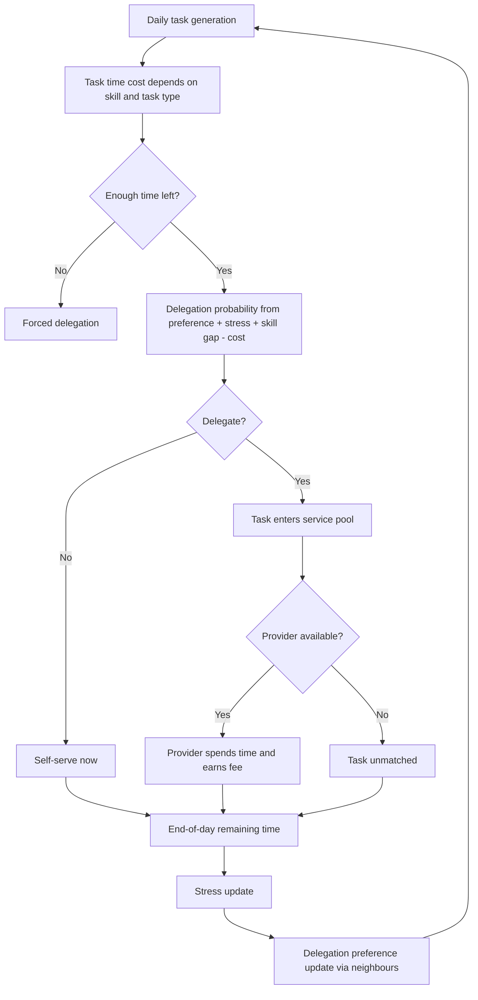
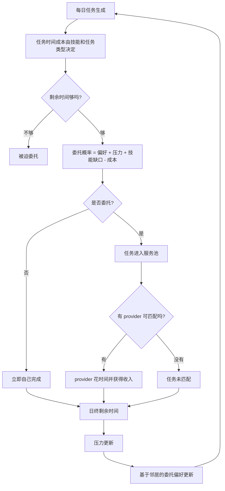

# Model Mechanics Cheat Sheet

**Project**: *The Convenience Paradox*  
**Purpose**: Fast-reference companion to the full experimental report  
**Companion Report**: `analysis/reports/2026-04-01_full_campaign_experimental_analysis_report_en_zh.md`

---

## English Version

### 1. One-Minute Model Summary

Each day, every agent receives tasks, decides whether to self-serve or delegate, and then may also provide services for other agents. The system-wide result is driven by five linked mechanisms:

1. Workload generation: how many tasks appear each day.
2. Delegation decision: whether a task is self-served or outsourced.
3. Matching capacity: whether another agent is available to do the task.
4. Stress feedback: time shortage increases stress.
5. Norm diffusion: stress and peer behaviour shift future delegation preferences.

The model is therefore a feedback system, not a static comparison.

### 2. Mechanism Flow

### 3. Parameter Effect Map

#### 3.1 Main sweep parameters

| Parameter | If increased | Most immediate effect | Typical downstream effect |
| --- | --- | --- | --- |
| `delegation_preference_mean` | Agents start more willing to delegate | Higher realised delegation | More provider work, more labour transfer |
| `service_cost_factor` | Service becomes more expensive | Delegation becomes less attractive | More self-service, lower realised delegation |
| `social_conformity_pressure` | Peer influence gets stronger | Faster local norm alignment | Greater path dependence and norm lock-in |
| `tasks_per_step_mean` | Daily workload rises | More total time demand | Stronger overload risk and stress escalation |
| `tasks_per_step_std` | Daily workload becomes more volatile | More busy-day spikes | More uneven stress exposure |
| `adaptation_rate` | Preference updates happen faster | Behaviour shifts sooner | Faster convergence or faster drift |
| `stress_threshold` | Stress starts at a higher remaining-time level | Agents become stress-sensitive earlier | More days in the stress-accumulation regime |
| `stress_recovery_rate` | Stress falls faster after a good day | Lower persistence of stress | Weaker stress-memory feedback |
| `initial_available_time` | Agents begin with more free time | More slack in daily schedules | Lower overload risk at the same task level |

#### 3.2 Hidden but important structural constants

| Constant | Value | Why it matters |
| --- | --- | --- |
| Provider proficiency | `0.60` | Delegated work is done by a competent generalist, not a perfect specialist |
| Stress boost in delegation | `0.30 x stress_level` | Stress directly pushes future delegation upward |
| Skill-gap weight | `0.25 x (requirement - skill)` | Under-skilled agents delegate more |
| Cost penalty | `0.25 x service_cost_factor` | Service price directly pushes against delegation |
| Stress amplification of conformity | `1 + 0.5 x stress` | Stressed agents copy neighbours more strongly |

### 4. Core Equations at a Glance

#### Task load

`num_tasks = max(1, round(N(tasks_per_step_mean, tasks_per_step_std)))`

#### Task time cost

`time_cost = base_time / clipped_skill`

If skill is below requirement:

`time_cost = time_cost x (1 + 2 x skill_gap)`

#### Delegation probability

`p_eff = clip(preference + 0.30 x stress + 0.25 x skill_gap - 0.25 x cost, 0, 1)`

#### Stress update

If `available_time < stress_threshold`:

`stress_next = min(1, stress + 0.10 x deficit_ratio)`

Else:

`stress_next = max(0, stress - stress_recovery_rate)`

#### Preference update

`preference_next = clip(preference + adaptation_rate x conformity_weight x (neighbour_mean - preference), 0, 1)`

where:

`conformity_weight = social_conformity_pressure x (1 + 0.5 x stress)`

### 5. How to Read the Main Metrics

| Metric | What it really means | How to interpret high values |
| --- | --- | --- |
| `avg_stress` | Mean time pressure across agents | The system is leaving too little end-of-day slack |
| `avg_delegation_rate` | Mean delegation preference | The norm is shifting toward or away from delegation |
| `tasks_delegated_frac` | Realised delegation behaviour | What agents actually did, not just what they preferred |
| `total_labor_hours` | Total collective time spent working on tasks | Higher values mean the system is more labour-intensive |
| `social_efficiency` | Tasks completed per labour hour | Lower values mean more coordination overhead or overload |
| `gini_available_time` | Inequality in end-of-day free time | Some agents keep leisure while others absorb burden |
| `gini_income` | Income inequality from service exchange | Provider/requester roles are diverging economically |
| `unmatched_tasks` | Delegated tasks without providers | Demand for convenience exceeds available service capacity |

### 6. How to Compare Preference vs Behaviour

Two metrics should always be read together:

- `avg_delegation_rate`: what agents are inclined to do
- `tasks_delegated_frac`: what agents actually did

Interpretation:

- High preference + high realised fraction: the environment supports delegation.
- High preference + low realised fraction: delegation is desired but blocked, usually by high cost or capacity shortage.
- Low preference + rising realised fraction: forced delegation is occurring because time is too scarce.

### 7. What Each Package Is Really Testing

| Package | Main question | What is held fixed | What is varied |
| --- | --- | --- | --- |
| Package A | What do the two full presets produce over time? | Nothing beyond preset bundles | Full Type A vs Type B bundle |
| Package B | When does convenience become overload? | Cost and conformity stay near default anchor | Delegation and workload |
| Package C | How much does cheap service alone explain? | Workload and most social structure stay near anchor | Delegation and service cost |
| Package D | Can mixed systems stay mixed? | Cost and workload stay near anchor | Delegation and conformity |

### 8. Result Reading Rules

Use these reading rules to avoid common mistakes:

1. Do not read `avg_delegation_rate` as actual delegation behaviour by itself.
2. Do not read high `total_labor_hours` as automatically meaning high `avg_stress`.
3. Do not read `service_cost_factor` as an endogenous market price; it is an external friction parameter.
4. Do not read Package D as a direct test of patience or waiting tolerance; it is a norm-convergence proxy.
5. Do not interpret story cases as averages; they are representative runs selected near the median of each case cluster.

### 9. Quick Interpretation of the Full-Campaign Results

| Observed result | Mechanistic reading |
| --- | --- |
| Type B has more labour but less stress at baseline | Delegation is high, but provider capacity is still sufficient under preset workload |
| Overload appears sharply at very high task load | Workload is the main trigger of capacity breakdown in the current model |
| Cheap service raises delegation but does not dominate all outcomes | Cost matters, but workload and norm dynamics still structure the regime |
| Mid-range systems are only moderately unstable | Conformity matters, but the current model does not produce strong bifurcation |

---

## 中文版

### 1. 一分钟理解模型

每天，每个 agent 都会收到一些任务，决定是自己做还是委托出去，然后也有可能反过来为别人提供服务。整个系统的结果由五个联动机制共同决定：

1. 工作负荷生成：每天出现多少任务。
2. 委托决策：任务是自助完成还是外包。
3. 匹配容量：系统里是否还有别人有空来做这个任务。
4. 压力反馈：时间不够会提高压力。
5. 规范扩散：压力和邻居行为会改变未来的委托偏好。

因此，这个模型本质上是一个反馈系统，而不是静态对比。

### 2. 机制流程图

### 3. 参数影响速查

#### 3.1 主要 sweep 参数

| 参数 | 如果提高 | 最直接影响 | 常见下游影响 |
| --- | --- | --- | --- |
| `delegation_preference_mean` | agent 初始更愿意委托 | 实际 delegation 提高 | provider 工作量增加，劳动转移更明显 |
| `service_cost_factor` | 服务更贵 | 委托吸引力下降 | 更多自助处理，实际 delegation 下降 |
| `social_conformity_pressure` | 同伴影响更强 | 局部规范更快对齐 | 路径依赖更强，更容易形成 lock-in |
| `tasks_per_step_mean` | 每日工作负荷更高 | 总时间需求上升 | 更容易过载，压力迅速累积 |
| `tasks_per_step_std` | 每日工作更不稳定 | 忙碌日尖峰更多 | 压力暴露更不均匀 |
| `adaptation_rate` | 偏好更新更快 | 行为更早发生转变 | 更快收敛或更快漂移 |
| `stress_threshold` | 更早进入压力区 | agent 更敏感 | 更多天会进入压力累积状态 |
| `stress_recovery_rate` | 好日子后恢复更快 | 压力持续性变弱 | stress-memory 反馈减弱 |
| `initial_available_time` | 每天起始空闲更多 | 日程余量变大 | 在相同任务量下更不容易过载 |

#### 3.2 隐藏但重要的结构常数

| 常数 | 数值 | 为什么重要 |
| --- | --- | --- |
| Provider proficiency | `0.60` | 被委托出去的任务由“能力尚可的通才”完成，而不是完美专家 |
| 压力对委托的推动 | `0.30 x stress_level` | 压力会直接推高下一轮委托 |
| 技能缺口权重 | `0.25 x (requirement - skill)` | 低技能 agent 更容易委托 |
| 成本惩罚 | `0.25 x service_cost_factor` | 服务价格越高，越压制委托 |
| 压力放大从众 | `1 + 0.5 x stress` | 压力越大，越容易模仿邻居 |

### 4. 核心公式速查

#### 任务负荷

`num_tasks = max(1, round(N(tasks_per_step_mean, tasks_per_step_std)))`

#### 任务时间成本

`time_cost = base_time / clipped_skill`

若技能低于要求：

`time_cost = time_cost x (1 + 2 x skill_gap)`

#### 委托概率

`p_eff = clip(preference + 0.30 x stress + 0.25 x skill_gap - 0.25 x cost, 0, 1)`

#### 压力更新

若 `available_time < stress_threshold`：

`stress_next = min(1, stress + 0.10 x deficit_ratio)`

否则：

`stress_next = max(0, stress - stress_recovery_rate)`

#### 偏好更新

`preference_next = clip(preference + adaptation_rate x conformity_weight x (neighbour_mean - preference), 0, 1)`

其中：

`conformity_weight = social_conformity_pressure x (1 + 0.5 x stress)`

### 5. 主要指标怎么读

| 指标 | 真正表示什么 | 高值如何理解 |
| --- | --- | --- |
| `avg_stress` | agent 平均时间压力 | 系统留给人的日终余量太少 |
| `avg_delegation_rate` | 平均委托偏好 | 规范正在朝委托或自助方向移动 |
| `tasks_delegated_frac` | 实际发生的委托行为 | agent 真正做了什么，而不是只想做什么 |
| `total_labor_hours` | 系统整体用于处理任务的总时间 | 值越高，系统越劳动密集 |
| `social_efficiency` | 每单位劳动时长完成的任务数 | 值越低，说明协调开销或过载更重 |
| `gini_available_time` | 日终可支配时间不平等 | 一部分人有余量，另一部分人承担了负担 |
| `gini_income` | 服务交换带来的收入不平等 | provider 和 requester 的经济角色在分化 |
| `unmatched_tasks` | 找不到 provider 的委托任务数 | 便利需求超过了系统服务容量 |

### 6. 如何同时看“偏好”和“行为”

有两个指标必须一起读：

- `avg_delegation_rate`：agent 倾向于怎么做
- `tasks_delegated_frac`：agent 实际怎么做了

解释方式：

- 偏好高 + 实际也高：环境支持 delegation。
- 偏好高 + 实际低：大家想委托，但被高成本或容量不足阻断。
- 偏好低 + 实际上升：说明时间太紧，开始出现“被迫委托”。

### 7. 每个实验包到底在测什么

| Package | 主要问题 | 固定了什么 | 改变了什么 |
| --- | --- | --- | --- |
| Package A | 两个完整 preset 长期会产生什么？ | 没有额外固定，直接比较 preset 整体 | 整个 Type A / Type B 参数包 |
| Package B | 便利在什么条件下会变成过载？ | 成本与 conformity 基本固定在默认锚点 | delegation 与 workload |
| Package C | 单靠低价服务能解释多少？ | 工作负荷和大部分社会结构固定在锚点附近 | delegation 与 service cost |
| Package D | 混合系统能否长期保持混合？ | 成本和 workload 固定在锚点附近 | delegation 与 conformity |

### 8. 阅读结果时的规则

用下面这些规则避免误读：

1. 不要把 `avg_delegation_rate` 单独当成实际 delegation 行为。
2. 不要把高 `total_labor_hours` 自动理解为高 `avg_stress`。
3. 不要把 `service_cost_factor` 理解为内生市场价格；它是外生摩擦参数。
4. 不要把 Package D 当成对“耐心”或“等待容忍度”的直接测试；它只是规范收敛代理。
5. 不要把 story case 当作平均结果；它们是每组中位数附近的代表性 run。

### 9. 对 full campaign 结果的快速解释

| 观察到的结果 | 机制解释 |
| --- | --- |
| Type B 在基线下劳动更多但压力更低 | delegation 很高，但在 preset 工作负荷下 provider capacity 仍够用 |
| 过载在极高 task load 下突然出现 | 当前模型里，workload 是容量崩溃的主触发器 |
| 低价服务会推高 delegation，但无法解释全部结果 | 成本重要，但 workload 与 norm dynamics 仍在主导 regime 结构 |
| 中间系统只表现出中等不稳定 | conformity 有作用，但当前模型没有出现强烈 bifurcation |

